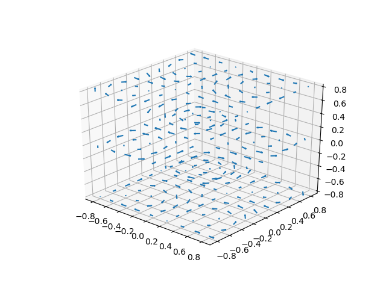
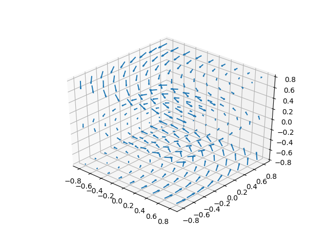
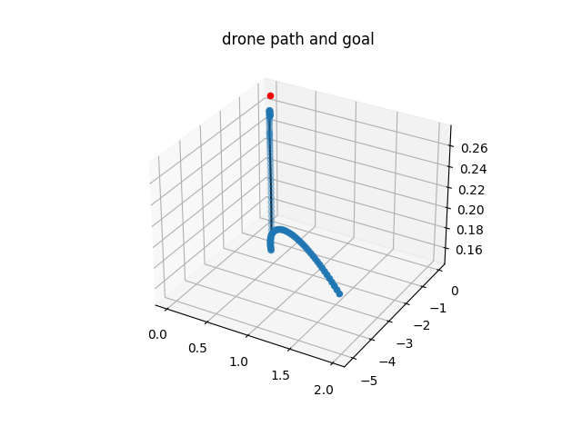
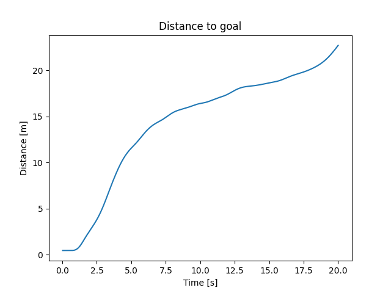

# robust-drone-pathfollowing 
Robust-drone-pathfollowing is a [Gym-Pybullet-Drones](https://github.com/utiasDSL/gym-pybullet-drones) extension, which is a [simple](https://en.wikipedia.org/wiki/KISS_principle) OpenAI [Gym environment](https://gym.openai.com/envs/#classic_control) based on [PyBullet](https://github.com/bulletphysics/bullet3) for multi-agent reinforcement learning with quadrocopter. This extension provides a Gym environment that uses a stochastical, random wind field for single-agent reinforcment learning.

> ## Citation
> will be added later...

## Installation
This repo was written using Python3.8 with conda on Ubuntu 20.04. However since it is only a [Gym-Pybullet-Drones](https://github.com/utiasDSL/gym-pybullet-drones) extension, it should be compatible with macOS 12 and also other future compatibilities.

### Conda
First install Conda. For Ubuntu 20.04 read [here](https://linuxize.com/post/how-to-install-anaconda-on-ubuntu-20-04/) for Information and Installation Instructions.

### Gym-Pybullet-Drones
More Information about [Gym-Pybullet-Drones](https://github.com/utiasDSL/gym-pybullet-drones) can be found on the corresponding Github repo.
```bash
$ conda create -n drones python=3.8
$ conda activate drones
$ pip3 install --upgrade pip
$ git clone https://github.com/utiasDSL/gym-pybullet-drones.git
$ cd gym-pybullet-drones/
$ pip3 install -e .
```

### Robust-Drone-Pathfollowing
Then, do:
```bash
$ git clone https://gitlab2.informatik.uni-wuerzburg.de/s408133/robust-drone-pathfollowing.git
```
Now, some files inside the changefiles directory have to be copied inside Gym-Pybullet-Drones:
```bash
$ cp robust_drone_pathfollowing/changefiles/WindSingleAgentAviary.py gym_pybullet_drones/envs
$ cp robust_drone_pathfollowing/changefiles/__init__.py gym_pybullet_drones/envs/__init__.py
$ cp robust_drone_pathfollowing/changefiles/other/__init__.py gym_pybullet_drones/__init__.py
```

### Test Installation
You can verify that there was no Problem by:
```bash
$ cd robust_drone_pathfollowing
$ python3 testInstall.py
```
Now you should see a flying drone that maybe is hit by a flying duck.
You can change different parameters, see:
```bash
$ python3 testInstall.py -h
```
By increasing the force vector of the wind you can see that the standard controller is not really robust against wind. 
It should be noted that in this script no generic wind environment was used. The wind force is appplied each time the controller is able to send RPMs in the script.
To really evaluate this controller the forces should be applied at each environment time step like done in the WindSingleAgentAviary class.
To further test the installation, use:
```bash
$ python3 learn.py
```
If done correctly, this should result in an short PPO learning process.

## HelpClasses
There are a couple of extensions that this extension is using. The most important classes will be shortly explained hereafter.

### Class `Wind`
The Wind class implements a random 3D wind field. It provides the necassary force vector dependent on the current position. In addition it can visualize the wind field like:



### Class `PathPlotter`
The PathPlotter class plots the path of the drone, as well as its goal. This resulst in plots like the one seen herafter(Agent not learned).

### Class `EvalWriter`
The EvalWriter class evaluates a model and writes its performance to an xlsx file. It evaluates the sucess rate, the sucess time rate, the average distance half way through the simulation, the average reward and plots path / goal if it is a signel evaluation by using the PathPlotter class.




## Class `WindSingleAgentAviary`
The WindSingleAgentAviary class is a subclass of the [SingleAgentAviary] (https://github.com/utiasDSL/gym-pybullet-drones/blob/master/gym_pybullet_drones/envs/single_agent_rl/BaseSingleAgentAviary.py) class. It models the Single Agent Problem to hover at a position under influence of strong wind.
The environment posses some different modes:

| mode | Wind | Goal |
|---------------------------------: | :-------------------: | :-------------------------------------------: |
| 0 | no wind | (0,0,z) |
| 1 | no wind | (x,y,z) |
| 2 |   yes, constant   | (x,y,z) |
| 3 |   yes, random     | (x,y,z) |

The environment can be instantiated by using `gym.make()`—see [`learn.py`](https://github.com/eislerMeinName/robust_drone_pathfollowing/blob/main/learn.py) for an example.

```python
>>> env = gym.make('WindSingleAgent-aviary-v0')
```
The environment can be stepped for example with an easy for loop:

```python
>>> obs = env.reset()
>>> for _ in range(10*240):
>>>     obs, reward, done, info = env.step(env.action_space.sample())
>>>     env.render()
>>> env.close()
```

## Script `learn.py`

## Script `eval.py`

## References


