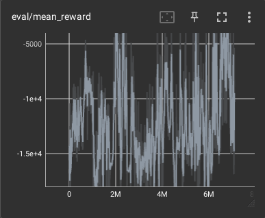
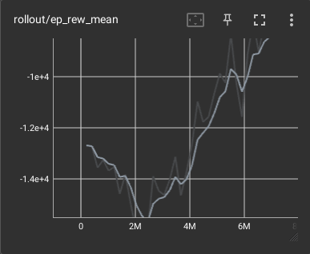
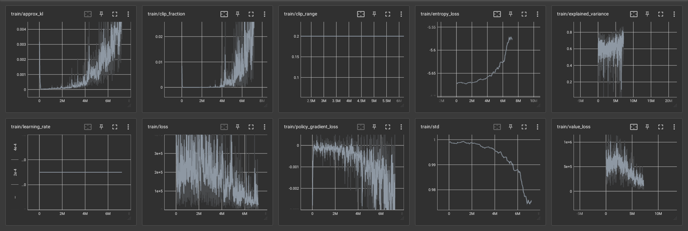

# Experiments in mode 0

## Learn:

```bash
$ python3 learn.py --steps 1e8 --mode 0 --algo PPO --upper_bound 1
$ tensorboard --logdir results/tb/PPO_1
```

## Evaluation:

```bash
$ python3 eval.py --mode 0 --upper_bound 1
```
## Figures:



